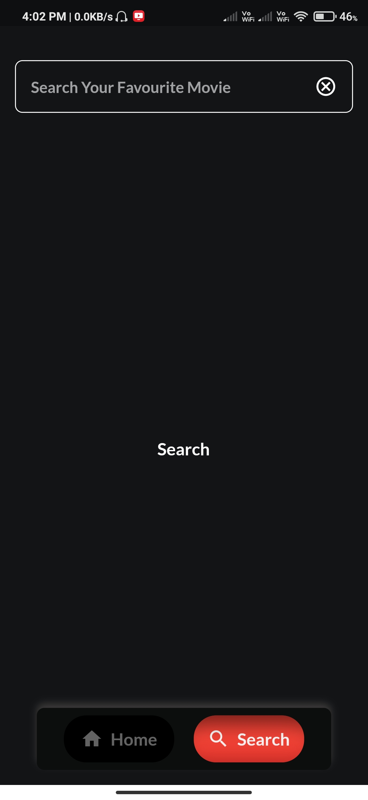
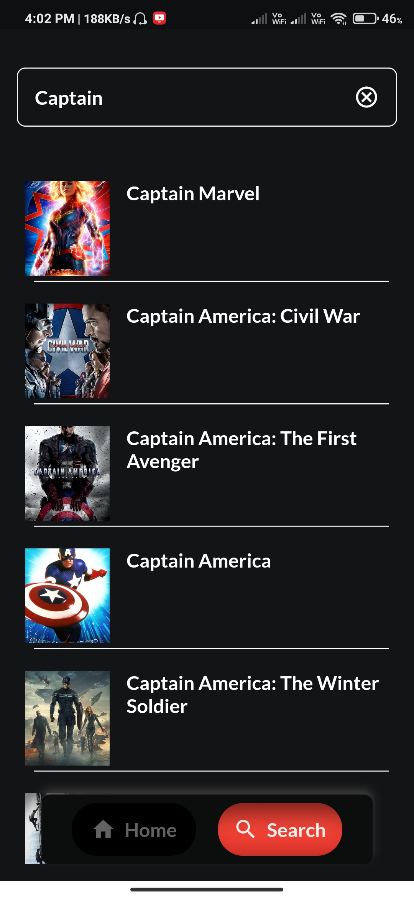

# CineHall

CineHall is a online movie review app which lets the user see which movies are trending, their reviews and casts. The app is fully build in Flutter and uses GetX as its state management solution.

# UI 

      
      
      
      

